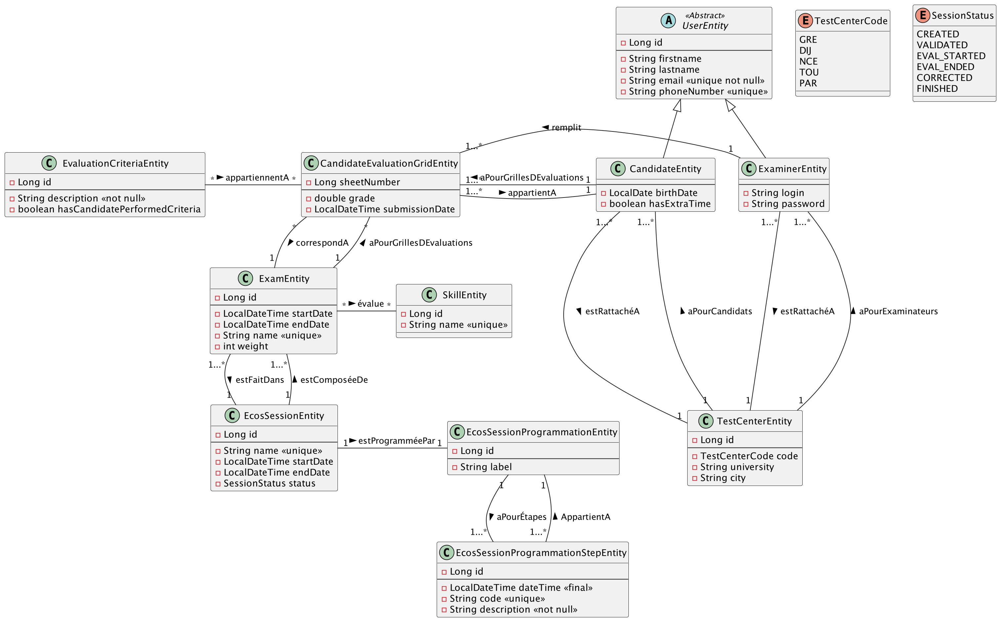

# <u>L3 Miage - VA - TP3 - <b style="color:red">noté</b></u>

* Pour pouvoir démarrer tous les TPs simplement, assurez-vous d'avoir tous les prérequis :
    * voir les [prérequis](prerequis.md)

# Situation 

Les ECOS (Examens Cliniques Objectifs et Structurés) sont des examens pratiques que passent les étudiants à l’issue de leur 6ème année de médecine, à la suite de l’examen théorique EDN (Épreuves Dématérialisées Nationales). Ces examens conditionnent leur accès au troisième cycle des études médicales et leurs choix d’internat et de spécialité.

Vous faites partie de l’équipe de développement qui va développer une application web permettant le déroulement d’une session d’examen ECOS. Votre architecte vous a fourni un diagramme UML que vous allez devoir implémenter.

Une session doit être programmée pour qu’elle puisse se dérouler correctement dans le temps. On lui rattache ainsi une programmation de session, qui est composée d'un label, et qui comporte plusieurs étapes de programmation. Chaque étape dispose d’un code unique, d'une date de réalisation et d’une description textuelle obligatoire. Une programmation de session appartient à une seule session, et une étape de programmation appartient à une seule programmation.

L’application accueille 2 types d’utilisateurs :
-	les candidats, qui possèdent une date de naissance, et qui peuvent ou non disposer d’un tiers temps. Les candidats n’utilisent pas directement l’application
-	les examinateurs, qui disposent d’un login de 6 caractères et d’un mot de passe pour se connecter à l’application et remplir la grille d’évaluation d’un candidat pour un examen donné

Tous les utilisateurs possèdent un nom, un prénom, un email unique et obligatoire, et un numéro de téléphone à 8 chiffres unique.

Chaque utilisateur est rattaché à un centre d’examen, composé d’un code, d’un nom d’université de rattachement et d’un nom de ville. Un centre d’examen accueille plusieurs candidats et examinateurs.

Pendant un examen, un examinateur se connecte à l’application, sélectionne le candidat qu’il doit évaluer, et remplit une grille d’évaluation. Chaque grille d’évaluation est composée d’une note, qui doit avoir 2 chiffres après la virgule, et d’une liste de critères d’évaluation. Un critère d’évaluation représente une tâche, une observation ou une demande que doit réaliser le candidat pendant l’examen pratique, et est représenté par une description textuelle, et une note d’observation (qui permet de savoir si oui ou non le candidat a réalisé correctement ce critère).

Une grille d’évaluation appartient à un unique candidat et est remplie par un unique examinateur.

* Dans ce TP, nous partons du principe que les entités et les repositories sont implémentés, ainsi que quelques endpoints au complet.

## Exo

1. Tester les fonctions nommées du repository `CandidateRepository`.

2. Testez les endpoints complètement (Component, Service, Controller) :
    * Récupération de la moyenne d'un candidat.
    * Création d'une session d'examen.

3. Implémenter, documenter et tester ces endpoints :
    1. Faire passer l'état d'une session de l'état `EVAL_STARTED` à `EVAL_ENDED`.
        * Vérification métier :
            * Vérifier que la dernière étape est déjà passée.
            * L'état précédent était bien `EVAL_STARTED`.
        * Code attendu :
            * 200 OK
            * 409 CONFLIT
        * Réponse :
            * Les copies des candidats
            * Si le cas est 409, un message comportant :
                * URI
                * Message d'erreur
                * État actuel de la session.

    2. Ajouter à un centre de test une collection d'étudiants.
        * Vérification métier :
            * Tous les étudiants ont plus de 18 ans.
        * Code attendu :
            * 202 ACCEPTED
            * 404 NOT FOUND, car le centre de test ou l'étudiant n'est pas trouvé.
            * 400 BAD REQUEST
        * Réponse :
            * Boolean
            * Si erreur :
                * URI
                * Message d'erreur
                * Le candidat demandé
                * Le centre de test demandé.

Vous avez jusqu'à dimanche 07/04 23h59 pour me commit vos changements ! 

N'oubliez pas le <b style="color:red">cr.md</b> pour les binômes, sinon je ne corrigerai pas.

---

# 
Fin de tp
